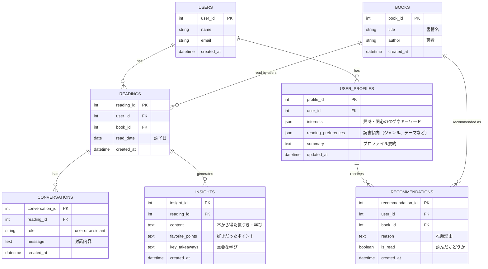

# Knowva - 技術アーキテクチャ仕様

## アーキテクチャ思想：曖昧さと再解釈の許容

### システム構成の全体像

Knowvaは**長期保存を本丸**として、以下の3層構成で設計します：

#### 1) 実行基盤（Agent Engine）
- **役割:** 会話の実行・ツール実行・セッション管理
- **技術:** LLM API（OpenAI/Claude等）+ アプリケーションロジック
- **責務:** ユーザーとの対話を「聞き上手」に進行させる

#### 2) 長期保存層（**本丸**）
以下の二層で、数年後の振り返りを可能にします：

**a) Google Cloud Storage（生ログ層）**
- **保存内容:** 会話全文のJSON/テキストログ
- **目的:** 完全な記録の永続化（不変・削除なし）
- **将来性:** 新しいAIモデルでの再分析に備える

**b) Firestore（解釈層）**
- **保存内容:** 読み返し用の「要約」「メモ」「索引」
- **目的:** パフォーマンスの高いクエリと表示
- **位置づけ:** 生ログから再生成可能なキャッシュ

#### 3) 検索基盤（必要になってから）
- **ベクトル検索:** 曖昧検索を強くしたくなったら追加
- **候補:** Pinecone / Weaviate / Firestore Vector Search

---

## データ保存の二層化戦略（詳細）

Knowvaは、将来的なAIモデルの進化やマルチモーダルなアート化（Rhizomatiks的な展開）を見据え、**データを「生ログ層」と「解釈層」の二層で管理する**アーキテクチャを採用します。

### 生ログ層（Raw Data Layer）= Google Cloud Storage
- **目的:** すべての対話・入力データを「その時点の生の記録」として永続化
- **保存先:** Google Cloud Storage (GCS)
- **保存内容:**
  - 対話の完全なJSON/テキストログ（会話全文）
  - ユーザー入力の生データ（タイムスタンプ付き）
- **特徴:**
  - **不変性:** 一度保存したら削除・編集しない
  - **再解釈可能性:** 将来的に新しいAIモデルで再分析できる
  - **数年後の振り返り:** 完全な会話履歴をいつでも読み返せる

### 解釈層（Interpretation Layer）= Firestore
- **目的:** アプリケーションが利用する「その時点でのAIの解釈」を保存
- **保存先:** Firestore（またはPostgreSQL等のアプリケーションDB）
- **保存内容:**
  - 構造化された読書記録
  - AIが抽出した学び・気づき（要約）
  - 検索用の索引・メタデータ
  - ユーザープロファイル
- **特徴:**
  - **可変性:** AIモデルの進化に応じて再解釈・上書き可能
  - **パフォーマンス重視:** クエリ最適化された構造
  - **読み返し用:** UIで高速に表示するための最適化

この二層化により、「今のAIでできる最良の解釈」でアプリを動かしながら、将来的に「あの時の対話を新しいAIで再分析する」といった展開が可能になります。

---

## データ構造（MVP版）

MVPでは、最小限のテーブル構造で開始します。複雑な機能は後のフェーズで追加します。



### Agentが聞き出す情報の保存方法

MVPの対話でAgentが聞き出す情報は、以下の形で保存します：

**保存先の考え方:**
- **生ログ層（Google Cloud Storage）**: 対話の完全な内容をJSON形式で永続保存
- **解釈層（Firestore）**:
  - `CONVERSATIONS.message`: 対話内容（テキスト）
  - `USER_PROFILES.summary`: AIが抽出したプロファイルの要約（テキスト）
  - `USER_PROFILES.interests`, `reading_preferences`: 構造化されたタグ（JSON）

専用カラムを設けなくても、テキストフィールドやJSONフィールドに柔軟に格納できます。

**Phase 2以降で検討する拡張:**
- BOOKSテーブルの拡張（ISBN、出版社、ジャンル、表紙画像、書籍説明等）
- より詳細なユーザープロファイル管理（時系列での思想の変化を追跡）
- 生ログへの参照管理の最適化

---

## 生ログ層のストレージ構造（Google Cloud Storage）

```
/users/{user_id}/
  ├── conversations/
  │   ├── {reading_id}/
  │   │   ├── full_log.json  # 対話の完全ログ（AI応答、タイムスタンプ等を含む）
  │   │   └── metadata.json
  ├── reading_sessions/
  │   ├── {reading_id}/
  │   │   ├── session_data.json  # 読書セッション中の全入力データ
  │   │   └── ...
```

**生ログの利点:**
- 将来的に新しいAIモデルで再分析可能
- 対話の文脈やニュアンスを完全に保持
- マルチモーダルなアート生成（映像化・漫画化）の素材として活用

---

## 技術スタック

### 1) 実行基盤（Agent Engine）
**会話・ツール実行・セッション管理**
- **Agent Framework: Google ADK (Agent Development Kit)** ← 採用予定
- LLM API: Gemini API / OpenAI API (GPT-4) / Anthropic Claude
- その他Framework: LangChain / LangGraph（参考）
- セッション管理: Firestore Session / Redis

### 2) 長期保存層（本丸）
**a) Google Cloud Storage（生ログ層）**
- Google Cloud Storage (GCS)
- 会話全文の完全保存

**b) Firestore（解釈層）**
- Firestore（または PostgreSQL / MongoDB）
- 読み返し用の要約・メモ・索引

### 3) 検索基盤（必要になってから）
- ベクトル検索: Pinecone / Weaviate / Firestore Vector Search
- 全文検索: Algolia / Elasticsearch（オプション）

### フロントエンド
- React / Next.js / Vue.js
- 音声録音: Web Audio API / MediaRecorder API（Phase 2以降）

### バックエンド
- Node.js / Python (FastAPI) / Go
- バックグラウンドジョブ: Bull (Redis Queue) / Cloud Tasks / Celery（Phase 2以降）

### インフラ
- Vercel / Cloud Run / Firebase Hosting
- 非同期処理: Cloud Functions / Lambda（Phase 2以降）
